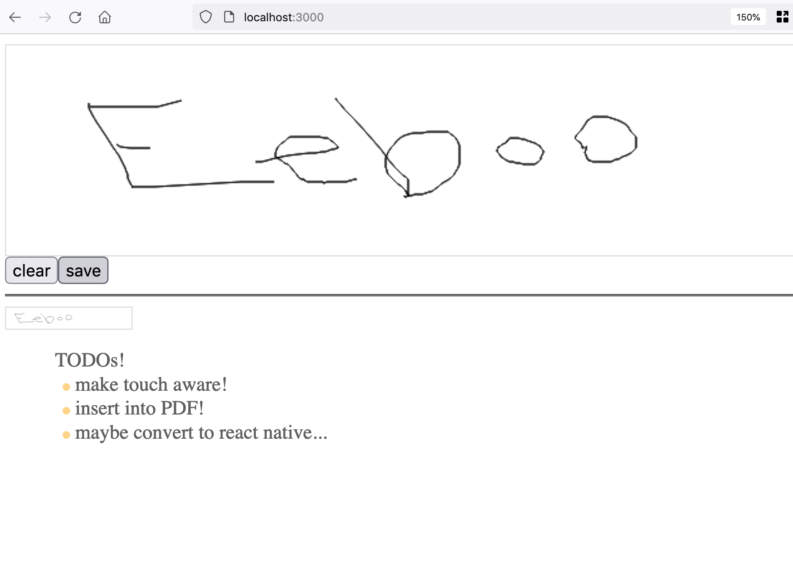

# What is this

It is a canvas + signature collection react thing.

# TODO:

Send the image blob to a server  
Make this 'touch' aware  
Maybe convert to react native

# MUST DO:

Read about how 'e-signatures' work

# TDD

npm test tdd.test.js

# Screen cap

Here is screen cap

npm test tdd.test.js 

# Deps
npm install --save-dev @testing-library/react-hooks
npm install --save-dev react-test-renderer
